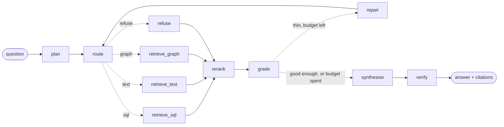

# Filing Room

Agentic RAG over SEC filings. Numeric facts from XBRL, narrative from the filing
text, and relationships from an entity graph — routed by an agent, verified
against the source, and every answer traceable to the filing it came from.

Runs on free API tiers. Full build plan: [`docs/build-plan.html`](docs/build-plan.html).

**Status: M6 shipped — the agent answers the same 150 questions at 98.8% exact
on numbers against the baseline's 7.5%, and every figure it prints is now
recomputed against the source before it ships: 0 hallucinated figures in 133,
every citation resolving, and 426 of 427 deliberately corrupted answers caught.
One M5 gate criterion is still missed and still said so below.**
M0 the rig, M1 the corpus, M2 the fact store, M3 the text index and the entity
graph, M4 the frozen question set and the naive baseline, M5 the routed agent,
M6 the verifier and the failure taxonomy.

| Gate | What it produced | Check |
|---|---|---|
| **M0** the rig | one model interface, three backends, limiter, cache, tracing | `filing smoke` — 5/5 |
| **M1** the corpus | 20 companies, 407 filings, 1,044 MB, every hash verified | `filing corpus --check` — 6/6 |
| **M2** the numbers | 514,649 facts, 25 metrics, 0 duplicate keys | `filing numbers` — 5/5 |
| **M3** the text | 58,844 chunks, 32,218 indexed, 2,986 graph edges | `filing text` — 6/6 |
| **M4** the yardstick | 150 frozen questions, 260 gold spans, naive index of 48,934 chunks | `filing.eval run --config baseline` — 150/150, 4 live calls |
| **M5** the agent | router + 3 stores + grader + repair(≤2), 98.8% numeric exact, router 0.833 | `filing.eval run --config agent` — 150/150, 0 errors, 290 calls |
| **M6** the guard | numeric verifier, citation resolver, abstention guard, 4-tag taxonomy | `filing.eval run --config agent-guarded` — 0 hallucinated / 133, 0 blocked |

784 tests, `ruff` clean, and no test may open a socket off this machine.

---

## Quick start

```bash
conda create -p .conda python=3.12 -y
.conda/python.exe -m pip install -e ".[dev]"
cp .env.example .env      # then paste a key from https://aistudio.google.com/apikey
docker compose up -d      # phoenix (traces) + qdrant (vectors)
.conda/python.exe -m filing.cli smoke
```

On Windows, `pwsh -File make.ps1 <target>` stands in for `make <target>`.

**No Docker?** The trace collector can run as a plain process instead, which is
also the shape CI wants:

```bash
.conda/python.exe -m pip install -e ".[phoenix]"
.conda/Scripts/phoenix serve      # serves localhost:6006, same as the container
```

Everything except the vector store works this way.

## The commands

```bash
filing smoke      # M0 gate: chat + embed + rerank + cache dedup + tracing
filing probe      # which model IDs are still live
filing cache      # cache stats, and --clear
filing ingest     # download the corpus (SEC, rate-limited to 8 req/s)
filing corpus     # M1 gate: what was fetched, --check re-verifies every hash
filing facts      # build data/facts.duckdb from the downloaded XBRL
filing numbers    # M2 gate: 5 checks over the fact store
filing chunks     # parse + split + chunk the filing text, cached to parquet
filing index      # embed the narrative chunks into Qdrant, build BM25 beside
filing graph      # entity/relation extraction into a NetworkX graph
filing text       # M3 gate: 6 checks over the chunks, indexes and graph
filing failures   # M6: the failure taxonomy, counted by a Phoenix filter

python -m filing.eval verify                        # the frozen 150 still land on their spans
python -m filing.eval run --config baseline-retrieval   # score the retriever, no LLM at all
python -m filing.eval run --config agent            # M5 gate: the routed agent over all 150
python -m filing.eval run --config agent-guarded    # M6 gate: the same agent, verified before it ships
python -m filing.eval run --config agent-flagged    # the same check, reported instead of enforced
python -m filing.eval trace --qid num-001 --live    # one question's span tree, into docs/
python -m filing.eval depth --depth 500             # how far down the ranking the evidence sits
```

`ingest` takes hours, and `index` takes two and a half on CPU. Everything else
is rebuildable in under a minute — and a re-run of `index` over an unchanged
corpus costs nothing at all, which is what the M3 gate's third check proves.

## What is in the repo, and what is not

`data/manifest.duckdb` **is committed** (3.4 MB). It is the only record of what
was fetched, when, and with which hash, and re-deriving it means pulling 1.1 GB
back through a host that rate-limits to 10 requests a second.

`data/facts.duckdb` **is not** (15 MB). It is a pure function of the JSON on
disk and `filing facts` rebuilds it in about 25 seconds.

The filings themselves are not, either. Clone, set `SEC_USER_AGENT`, and run
`filing ingest` — the manifest tells it exactly what to fetch.

---

## M0 — the rig

| Piece | Where | Why it exists |
|---|---|---|
| One model interface | `llm/base.py` | `chat` / `embed` / `rerank`. Nothing in this project calls a provider directly. |
| Model registry | `config.py` | Model IDs and rate limits live in one dict. Swapping providers is an entry, not a refactor. |
| Sliding-window limiter | `llm/limiter.py` | Per model, not per provider. Proven by unit test, not by hope. |
| Content-hash cache | `llm/cache.py` | Five weeks of eval re-runs on a finite free-tier budget. |
| Tracing | `tracing.py` | On from the first commit, because M5–M7 read these spans. |
| Six backends | `llm/gemini.py`, `llm/openai_compat.py`, `llm/fallback_ollama.py`, `llm/local.py` | One interface; hosted, self-hosted, in-process. `LLM_BACKEND` picks. Three of the six share one file. |
| Local reranker | `llm/rerank_local.py` | A real cross-encoder, no key and no quota — the one verb Gemini does not serve. |

`smoke` runs five checks and exits non-zero if any fails: **chat**, **embed** (a
vector of the dimension the registry claims), **rerank** (the cross-encoder puts
the *relevant* passage first, not merely any passage), **cache dedup** (the same
prompt twice issues one HTTP request, asserted on a counter rather than inferred
from timing), and **tracing** (at least three spans reached the collector).

Chat and embed carry a fresh run marker, so they cannot be served from cache.
That is a bug fix, not a flourish: the gate used to pass at `http calls: 0,
cache hits: 4`, replaying the previous run's answers, which meant a revoked key,
a retired model ID or an exhausted free tier all still printed **5/5**. A smoke
test that a warm cache can satisfy is testing the disk. The marker costs two
live calls per run and buys the only thing the command is for; check 4 then
repeats the *marked* prompt, so dedup is still proved, on an entry this process
wrote seconds earlier. Rerank keeps its cache deliberately — it is a local
forward pass on every backend, so no credential can be hiding behind it.

The offline half runs in `pytest` with the network stubbed, so CI needs no API
key. Only `chat` and `embed` genuinely need one.

### When a model ID dies

Expected, not exceptional. Run `filing probe`, find a candidate marked `live`,
and copy it into `MODEL_REGISTRY` in `src/filing/config.py`. That is the entire
fix — no other file names a model.

Not hypothetical: on the first live run every Gemini 2.x chat ID in the registry
answered 404 — *"no longer available to new users"* — while embeddings kept
working. The fix was two registry lines and no code.

One thing that run taught, which the code now encodes: **a model listing is not
a probe.** `ListModels` cheerfully returned `gemini-2.5-flash` for a key that
could not call it, so `filing probe` issues a real request per ID instead of
trusting the catalog. It also avoids `*-latest` aliases as primaries — those
float under you, and the one time it mattered `gemini-flash-latest` answered 503
while the pinned ID was fine.

The same lever handles a whole provider dying, which is also not hypothetical:
this project moved off NVIDIA NIM mid-M0 when its account verification proved
impassable. That cost one new backend file and one registry entry; the limiter,
cache, tracing, and every test carried over untouched. Containing that blast
radius is what M0 was for. The NIM backend was later deleted outright, once it
was clear the account could never be verified from here -- a provider nobody can
run is not a fallback, it is a claim the README cannot back.

## M1 — the corpus

20 companies across four sectors, five fiscal years, 10-K and 10-Q, plus the
full XBRL company-facts payload per company. 407 filings, 1,044 MB.
[`docs/corpus.md`](docs/corpus.md) is generated, not written.

Two things this gate taught, both of which are now enforced in code:

- **A gate that only counts can pass while a company contributes nothing.**
  The first `corpus --check` was green while Exxon had zero filings: its
  submissions live under a *different CIK* than the one the ticker map gives,
  because the operating company was reorganised under a new holding company. The
  check now asserts per-company minimums, not a corpus-wide total.
- **The manifest is the source of truth, not the filesystem.** There are 21
  company-facts payloads on disk for a 20-company universe — the extra is
  Exxon's old CIK. A directory glob would load both and produce two half-Exxons
  that each look complete. `tests/test_facts_store.py` asserts the build reads
  the manifest.

## M2 — the numbers

`data/facts.duckdb`: 514,649 facts, 2,827 concepts, 25 named metrics, and views
that answer the questions the agent will ask (`annual`, `growth`,
`facts_current`, `restatements`). `filing numbers` runs five checks over it.

The load goes through CSV staging and `COPY`, not `executemany` — DuckDB's
Python `executemany` does roughly 380 rows/s, which is 22 minutes for this
table. `COPY` does it in 17 seconds.

What this gate taught, in the order it hurt:

- **A tag is not a period.** `NetIncomeLoss` carries quarters, halves,
  nine-month stubs and full years under one name. Summing the tag over a year
  triple-counts. Every fact gets a `span`, classified by nearest canonical
  length with a 25-day tolerance — because a 4-4-5 retail half-year is 168 days
  and a fixed range around 182 discards it.
- **`fy`/`fp` describe the filing, not the fact.** They disagree with the year
  of `period_end` in 54.9% of rows. Stored as `filed_fy`/`filed_fp`; never a key.
- **A declared UNIQUE constraint is not the check.** SQL treats NULLs as
  distinct, and `period_start` is NULL for the 195,325 instants, so the
  constraint silently exempts 38% of the table. The check is a `GROUP BY`, which
  treats NULLs as equal.
- **"Latest value wins" is right per fact and wrong per statement.** 11,359 keys
  are restated. Taking the newest value for each one independently assembles a
  balance sheet out of two different filings that has no reason to balance —
  Costco's FY2014 and FY2016 numbers, mixed. The identity check groups by `accn`.
- **The balance-sheet identity has four right-hand terms**, not two: total
  liabilities, equity including NCI, the pre-ASC-810 `MinorityInterest` line,
  and mezzanine equity. With all four it closes on 1,717 statements with zero
  violations.
- **Sign is documented, never mutated.** Capex is reported positive, so the
  metric carries `sign="outflow"` and `free_cash_flow` is a subtraction.

### Two resolution rules, because there are two kinds of ambiguity

A metric that arrives under several tags resolves either by coverage or by
priority, and which one is correct depends on *why* there are several tags.

- **Coverage** (`n_facts DESC`) for a **succession** — one tag replaced another.
  Revenue's tags are the pre- and post-ASC-606 names for the same line, so the
  one with the most facts is simply the one in force for most of the window.
- **Priority** (registry order) for **near-synonyms** — several tags coexist and
  mean subtly different things. Equity is the only such metric: the
  parent-only, including-NCI and total variants are all live, all common, and
  picking the most frequent picks whichever the bigger companies happen to use.

### How the numbers are checked

Not against a spreadsheet I typed. `filing numbers` asks 50 questions whose
answers were read out of the filings, and separately takes a sample of stored
values and **searches for each one in the filing document it claims to come
from** — at every scale a statement might use (units, thousands, millions) and
both grouped and parenthesised, because an accounting statement writes a loss as
`(1,234)`.

49 of 50 resolve. The one that does not is honest and worth stating: that check
can only sample facts whose accession number matches a filing we actually
downloaded, and **only 31% of the store does**. The manifest covers FY2020–2024;
company-facts reaches back to 2009 and forward into 2026. Facts outside the
window are real and correct, they simply have no local document to be read out
of. This constrains M6 — an answer resting on a pre-2020 fact cannot cite a
locator — and the retriever will be scoped accordingly.

## M3 — the filing text

407 filings parsed into 58,844 chunks that never lose their character offsets,
32,218 of them indexed into Qdrant and BM25, and 2,986 entity relations in a
NetworkX graph with the source sentence on every edge. `filing text` runs six
checks; the details are in [`docs/parsing.md`](docs/parsing.md) and
[`docs/retrieval.md`](docs/retrieval.md).

**The free tier's wall is documents per day, not requests per minute.**
`batchEmbedContents` bills *each text in the batch* as its own `embed_content`
request against a 1,000/day free-tier cap — so a 32-chunk batch spends 32 of
the day's thousand, and this corpus would take **33 days** to index once. Rate
limits you can pace around; a daily cap you cannot. The vector space moved onto
the CPU in this machine: `bge-small-en-v1.5`, **32,218 chunks in 140.6 minutes**
at 230 chunks/min, no key and no quota. Generation stays hosted, because that is
one call per *answer*; embedding is one call per *chunk*, and only one of those
scales with the corpus.

Four things this gate taught:

- **A bi-encoder's asymmetry is a prompt, not a parameter.** BGE wants an
  instruction on the query and nothing on the passage; E5 wants a prefix on
  both. Get it backwards and nothing raises — every vector is still 384
  numbers and retrieval is merely worse. The prefix table is unit-tested per
  family for exactly that reason.
- **Recall@50 of 100% is a weak result wearing a strong number.** Gold sets run
  21–318 chunks, so landing one of them in a 50-candidate window is easy. The
  informative statistic is where the *first* gold chunk lands: rank 1 for 19 of
  30 questions, inside the top 5 for 26, worst case 24.
- **The cross-encoder did not earn its latency here.** p@5 went 0.687 → 0.693,
  which passes a `> 0` gate and means nothing: 8 questions better, 7 worse, 15
  unchanged. The threshold stays where it was written — moving it after seeing
  the split would be picking a gate this run happens to pass — and M4's 150
  questions are where a delta that size becomes legible.
- **A gate command nobody has run is not a gate.** `filing text` had two
  crashing bugs on first execution: a missing constructor argument and a path
  joined against the project root instead of the data directory. Both were in
  code that reads perfectly well.

---

## M4 — the yardstick

150 frozen questions — 80 numeric with gold read out of XBRL, 60 narrative with
hand-checked gold spans, 10 unanswerable — tagged `v1.0` with a datasheet, and
a deliberately naive baseline to measure against: 2,048-character chunks, one
dense search, one LLM call. The write-up is
[`docs/baseline.md`](docs/baseline.md).

**The baseline is reported as two runs.** A RAG answer fails two separable
ways: the retriever never found the evidence, or the generator fumbled evidence
it had. Only the second needs a model, and conflating them means every later
improvement gets argued about instead of attributed.

| slice | n | exact | router | cite ok | cite gold | abstain |
|---|---|---|---|---|---|---|
| numeric | 80 | 7.5% | — | 100% | 22.2% | — |
| narrative | 60 | — | 51.7% | 100% | 12.9% | — |
| unanswerable | 10 | — | 100% | — | — | **100%** |
| overall | 150 | 7.5% | 27.3% | 100% | 13.9% | 100% |

**It always cites, and it rarely cites right.** `cite ok` 100% against `cite
gold` 13.9%: every answer resolves to a real chunk, and seven times in eight it
is not the chunk holding the evidence. A citation that resolves is not a
citation that supports, and a reader checking a filing only cares about the
second. The one thing it does perfectly is refuse — all ten unanswerable
questions abstain, and not by hedging, since it answers the other 140.

One number needs chasing rather than celebrating: numeric `exact` (7.5%) is
*higher* than numeric `hit@5` (2.5%), so the model gets figures right more often
than the evidence for them is retrieved. Either the gold is under-annotated or
flash-lite is reciting Apple's revenue from pretraining — and if it is the
second, that 7.5% is contamination, not capability.

The generator is `gemini-3.5-flash-lite`, chosen by the gate rather than by
preference: the free tier caps `gemini-3.5-flash` at **20 requests per day**, so
150 questions is an eight-day baseline and a re-run is eight more, which fails
M4's own requirement that a full run fit the rate-limit budget. The results file
names the model, so the weaker generator is stated rather than hidden.

`--config baseline-retrieval` blanks every chat field before fingerprinting and
scores the retriever alone: 150 questions, 104 seconds, **zero API calls**, and
generation columns report `None` rather than `0.0%`, because "routed everything
wrong" and "does not route" are different claims.

| slice | n | hit@1 | hit@5 | hit@10 | nDCG@5 |
|---|---|---|---|---|---|
| numeric | 80 | 2.5% | 2.5% | 5.0% | 0.008 |
| narrative | 60 | 10.0% | 15.0% | 30.0% | 0.105 |
| overall | 150 | 5.7% | 7.9% | 15.7% | 0.050 |

That is the **ceiling** on everything the generating half can score, which is
why it was worth measuring first.

**hit@10 says the retriever failed; depth says how.** `filing.eval depth` walks
the ranking to 500 and asks where the gold chunk actually sits:

| slice | n | hit@10 | hit@50 | hit@100 | hit@500 | median rank | right filing @10 |
|---|---|---|---|---|---|---|---|
| narrative | 60 | 30.0% | 55.0% | 63.3% | 86.7% | 24 | 70.0% |
| numeric | 80 | 5.0% | 12.5% | 18.8% | 43.8% | 147 | 26.2% |

Two different failures wearing one low number. On narrative the evidence is
*present but mis-ranked* — median rank 24, and 30% → 55% between depth 10 and
50 is headroom a reranker or a better chunking can actually collect. On numeric
it is not close: median rank 147, and for 45 of 80 questions the gold chunk is
absent from the top 500 of 48,934 entirely. Nothing downstream repairs that; no
reranker reorders a list the passage is not in. This is the project's routing
thesis stated as a measurement rather than an assumption — **numeric questions
belong in SQL, and here is the 2.5% hit@5 that says so.**

Three things this gate taught:

- **A suspicious number gets a positive control before it gets published.** The
  first control — querying with the gold text — returned 2 of 12 and looked
  like a broken retriever. The clean one, a chunk's own text as its query,
  returned rank 1 six times out of six at cosine 0.95–0.98. The plumbing was
  fine; the control was confounded, because numeric gold spans have a **median
  length of 6 characters** — the digits of the figure — so the first control
  had queried with a six-character string. Narrative spans run 816.
- **Errors are never cached.** A 429 is a fact about the afternoon, not about
  the system. The asymmetry decides it: re-answering a question that would have
  succeeded costs one call, while remembering a 429 forever silently caps the
  score with no failing test anywhere.
- **Hermeticity is enforced, not assumed.** A test that passed `None` for its
  backend and trusted a warm cache turned into a *live* API call the moment a
  cache miss appeared — and quietly spent the day's real quota inside `pytest`.
  `tests/conftest.py` now fails any test that opens a socket off this machine,
  and the two affected files went from 121s to 1.9s, nearly all of it retry
  backoff against a wall.
- **A results file that misnames its model is worse than no results file.** A
  config declaring `chat_backend="ollama"` was fingerprinted, cached and written
  under `llama3.2:3b` while all 180 of its calls went to Gemini, because the
  runner built its client from the environment and used the config's field only
  as a label. It completed cleanly and the numbers looked fine, which is exactly
  what made it dangerous — nobody re-checks a plausible number. It surfaced by
  accident, through a 503 quoting *"this model is currently experiencing high
  demand"*, which is not a sentence a localhost server says. The fix is one
  argument; the test asserts the constructed backend equals the fingerprinted
  one, so the label and the call cannot drift apart again.

---

## M4.5 — the provider bake-off

M0 claimed that swapping providers is a registry entry, not a refactor. Nothing
had tested that claim: the project had run on one hosted provider since the
first commit, and a claim nobody has tried is a comment, not an interface.

Three free tiers went in — Cohere, Groq, OVHcloud — chosen for how differently
they meter rather than for how they benchmark, because the interesting question
is what the *shape* of a free tier does to a 150-question run. All three speak
OpenAI, so all three arrive as one file, [`llm/openai_compat.py`](src/filing/llm/openai_compat.py),
keyed by provider name. There is no `CohereBackend` and no `GroqBackend`. The
claim holds.

**Same retriever, different generator.** `baseline-cohere`, `baseline-groq` and
`baseline-ovh` reuse the naive baseline's index, top-5 and prompt unchanged, so
the generator is the only variable. That the ablation is clean is checked rather
than asserted: every retrieval metric below is *byte-identical* to `baseline`.

| config | generator | exact (num) | router | abstain | cite ok | cite gold | wall |
|---|---|---|---|---|---|---|---|
| `baseline` | `gemini-3.5-flash-lite` | 7.5% | 27.3% | 100% | 100% | **13.9%** | 0.9 min |
| `baseline-cohere` | `command-a-03-2025` | **8.8%** | **31.3%** | 100% | 100% | 9.5% | 8.9 min |

A bigger model is a better reader and a worse citer: `command-a` gains 1.3 points
of exact match and 4 of routing over flash-lite, and gives back 4.4 points of
citation groundedness. Both refuse all ten unanswerables. Neither changes the
picture M4 established — the retriever is the ceiling, and no generator argues
its way past a passage it was never handed.

**What each free tier actually meters, measured rather than read.**

| provider | the binding limit | what it costs a 150-question run |
|---|---|---|
| Cohere | **calls** — 20 rpm, 1,000 a *month* | 9 minutes, and 15% of the month |
| Groq | **tokens/day** — 200,000 per model | ~47 questions; a full run takes three days |
| OVHcloud | **a shared anonymous pool** | unavailable — see below |

Groq's row is the one that cost something to learn. The documented headline is
1,000 requests a day, which at 150 questions sounds like a sixth of the budget.
The live `x-ratelimit` headers correct that — 8,000 tokens per minute, resetting
in 570 ms, so the registry's `rpm=2` is the real pace and not caution. Headers
beat docs, which was the lesson going in.

The run then found the limit that beats both. At question 72 of 150 it stopped
on `200,000 tokens per day, per model` — a cap that appears in **no header**,
is not the requests-per-day number the docs lead with, and shows up only in the
body of the 429 that ends you. At ~4.2k tokens a question that is 47 questions a
day, so a 150-question baseline on Groq's free tier is a three-day run.

Which sharpens the M0 lesson rather than repeating it. "Probe, don't read the
listicle" got the per-minute pace right and still missed the constraint that
mattered, because a probe measures what a single call is allowed and a *run*
measures what a thousand calls are allowed.

So Groq is scored over the 72 questions that completed, with the other two
generators re-scored on the **same 72** from cache for zero calls. The runner
refuses to write a subset under a config's canonical filename — these land as
`*.partial.json` and print `PARTIAL: not the gate's run; not comparable to one`
— which is the machinery that makes stating it this way cheaper than rounding
it up.

| on the same 72 questions | exact (12 numeric) | router | cite ok | cite gold |
|---|---|---|---|---|
| `gemini-3.5-flash-lite` | 33.3% | 43.1% | 100% | 14.7% |
| `command-a-03-2025` | 33.3% | **51.4%** | 100% | 9.9% |
| `openai/gpt-oss-120b` | 33.3% | 48.6% | 100% | **15.6%** |

**All three get the same four of twelve right.** Not similar rates — the same
questions, and every retrieval column identical to the last digit across all
three. A 111-billion-parameter open model, a frontier-adjacent commercial one
and Google's cheapest tier are separated by 8 points of routing and 6 of
citation groundedness, and by nothing at all on the metric the gate actually
calls correctness. That is the M4 finding arriving from a second direction:
when the evidence is not in the top 5, no generator reasons its way to it, and
when it is, all of them read it. Swapping the model is not the lever. This is
also why the bake-off was worth an afternoon and is not worth a week — the
question it answers is answered.

**Free with no account is not free.** OVHcloud was on the list for one property:
it answers unauthenticated requests, so no country list can take it away — which
mattered after `build.nvidia.com` turned out to be a wall this project could not
climb. The property is real and the availability is not. The anonymous pool is
shared and small, and across ~10 minutes of spaced probes it returned `429` on
every request and on every model in the registry entry — `Qwen3.5-397B`,
`Qwen3.5-9B`, `Llama-3.3-70B`, `gpt-oss-120b` alike, which is what makes it a
pool-level throttle rather than a wiring problem. The config stays in the runner
because the finding is the point: a tier with no credential also has no queue of
your own, and 150 sequential questions is more than an unowned queue will carry.

Three things this gate taught:

- **An absent header and an empty one are different requests.** The OpenAI SDK
  requires an `api_key` string, so a keyless provider gets a placeholder, and
  `Authorization: Bearer no-key-required` is *worse* than sending nothing:
  OVHcloud stops reading the request as anonymous and starts reading it as a
  **failed** credential. That is `403 authentication failed` on all 150
  questions of a run, which looks exactly like a key problem and is the precise
  opposite of one. The header is now stripped at the transport layer by an httpx
  request hook, and the proof it worked is that the 403 became a 429 — rejected
  became accepted-then-throttled.
- **A 403 is not always about the credential.** Groq sits behind Cloudflare bot
  protection, which fingerprints the client *before* the origin ever sees the
  key: a default Python `User-Agent` earns `403 Error 1010 — access denied based
  on your browser's signature`. Two providers, two 403s, two causes, neither of
  them the key. Both are now regression tests, because the cost of rediscovering
  either is an afternoon.
- **A metric that disagrees with every answer is the metric's fault.**
  `gpt-oss-120b` scored 0% on citations while citing correctly on every single
  answer, because it writes its brackets as U+3010/U+3011 — the CJK lenticular
  pair — and `parse_citations` matched ASCII only. The prompt asks for
  "bracketed numbers" and never promises a codepoint, so the model obeyed the
  contract and the regex did not. Published, that would have been a confident
  finding about a model, drawn entirely from a broken ruler.

---

## M5 — the agent

M4 ended with a number and a brief: the naive baseline scores **7.5% exact on
numbers** while retrieving the right evidence **7.9%** of the time. This gate is
the system built to beat it — a typed LangGraph state, a router that picks a
store per sub-question, three retrievers behind it, a deterministic grader, and
a repair loop that is allowed two attempts and then has to abstain.



That is the compiled graph, not a drawing of one —
`build_graph(Tools()).get_graph().draw_mermaid()` produces the same edges.
`verify` is M6's and is drawn here rather than in a second diagram, because the
claim above only stays true if this picture is the current graph.
`repair → route` is the only cycle, and a hard counter plus the graph's
`recursion_limit` are what stop it; the bound of two is a unit test, not a
comment.

### The result

Same 150 questions, same generator (`gemini-3.5-flash-lite`), same refusal token
and citation contract — imported from the baseline's module rather than
restated, so one rule scores both systems.

| | baseline | agent | |
|---|---|---|---|
| numeric exact match | 7.5% | **98.8%** | +91.3 |
| numeric router accuracy | 0.0% | **98.8%** | +98.8 |
| narrative hit@5 | 15.0% | **40.7%** | +25.7 |
| narrative cite-gold | 12.9% | **28.0%** | +15.1 |
| unanswerable abstention | 100% | 100% | — |
| overall router accuracy | 27.3% | 83.3% | +56.0 |
| LLM calls | 4 | 290 | |

That 98.8% read 97.5% until M6's verifier found a sign bug in the scorer, not
in the agent — see [M6](#m6--the-guard). One question moved; nothing else did.

150 questions, 0 errors, 25 minutes, 290 hosted calls — under two per question,
which is the budget the design was built to: plan and route are one call,
retrieve/rerank/grade/repair are local and deterministic, synthesis is the
second call, and an abstention costs nothing.

### Four things worth saying plainly

**The gate asked for the multi-hop slice and the frozen set does not have one.**
M5's acceptance criterion is "+20 points absolute on the multi-hop slice". The
question set was frozen in M4 with three slices — numeric, narrative,
unanswerable — and no multi-hop among them. Unfreezing it to add the slice the
gate wanted would leave the baseline and the agent unmeasurable against each
other, so the criterion is restated against the **numeric** slice, where the
routing decision is the one multi-hop would have tested. It clears by +91.3
rather than +20. The substitution weakens the gate and is recorded here because
it is not visible in the table.

**The 98.8% is partly a tautology, and here is the part that is not.** The
numeric questions were generated from `facts_current`, and the SQL branch
queries `facts_current`. A system that resolves the metric name and the period
correctly is *expected* to return the same row. What the number does establish
is that the router sends numeric questions to the fact store (98.8%), and that
the text-to-SQL layer, constrained to the 25-metric registry, picks the right
row out of the near-duplicates — same tag, different period, different unit,
restated in a later filing. What it does not establish is anything about
retrieval, and it is quoted next to a retrieval column that is deliberately
empty.

**The empty retrieval column is the honest kind.** A supported citation is one
whose chunk overlaps a gold character span. An XBRL fact has no character span —
the value in DuckDB and the number printed in the filing are one fact reached
two ways, and only one way carries offsets. So `sql` and `graph` routes are
**excluded** from span scoring rather than scored zero, which is why the
scorecard now carries a visible `ret n` column: the agent's overall hit@5 of
40.0% is over the 60 questions that actually went to the text store, and that
subset is biased by construction — the numeric questions in it are exactly the
ones SQL could not answer. A `text` route that retrieved nothing still scores
zero. There is a test for each half, because an exclusion with no floor under it
is an excuse.

The accession-level check is the substitute: **79/79** of the sql-routed numeric
answers cite the accession the gold value came from. That is circular in the
same way, but it does rule out the failure it was aimed at — returning a real
number from the wrong filing.

**The router gate is missed: 0.833 against a bar of 0.85.** Not rounded up and
not sliced to a friendlier subset. The numeric slice is 98.8% and the
unanswerable slice is 100%; the narrative slice at 60.0% is what holds the total
under. Most of that 60% is not misrouting — the harness maps any
`INSUFFICIENT EVIDENCE` answer to `route="refuse"`, so a question routed
correctly to the text store, retrieved for, and then abstained on because the
evidence was thin is scored as a routing failure. The baseline is scored by
exactly the same rule, so the comparison is symmetric, but the metric is
measuring the whole pipeline's confidence and calling it routing.

### The retrieval ablation

Three retrievers, no generator, no key, no quota — the half of the evaluation
that runs on any machine.

| retriever | narrative hit@1 | hit@5 | hit@10 | ndcg@10 | overall hit@5 |
|---|---|---|---|---|---|
| `baseline-retrieval` — naive dense top-10 over 2,048-char chunks | 10.0% | 15.0% | 30.0% | 0.157 | 7.9% |
| `agent-retrieval-norerank` — hybrid dense+BM25, RRF fused | **20.0%** | **51.7%** | **63.3%** | **0.390** | **25.0%** |
| `agent-retrieval` — the same, then a cross-encoder over the top 50 | 16.7% | 45.0% | 60.0% | 0.361 | 19.3% |

The retriever is the gate's real win: semantic chunking plus hybrid fusion takes
narrative hit@10 from 30.0% to 63.3%. The baseline's ceiling more than doubled
before a single model call.

The third row is the one worth reading twice. The cross-encoder
(`ms-marco-MiniLM-L-6-v2`) is a **local** forward pass, so it costs no quota and
no key — and a stage that costs nothing is a stage nobody audits. This project
had been running it since M3 on the strength of it being obviously a good idea.
Ablated out, the fused order scores *higher* at every depth on both slices.

Before deleting it: on the 60 narrative questions the two orderings disagree on
**16**, of which the fused order wins 10 and the reranker wins 6. A paired exact
test puts that at **p = 0.45** (p = 0.75 at hit@10). It is a coin flip. So the
finding is not "the reranker hurts" — it is that a stage the pipeline had been
given for free bought nothing measurable, and that n = 60 cannot separate the
two. Truncation is not the explanation either: the tokenizer puts only **5.8%**
of chunks over the model's 512-token window. It is domain — an MS MARCO
web-passage relevance model reading 10-K prose, against a fusion that already
carries the lexical signal.

So the reranker stays on in the headline `agent` config, and the config that
removes it is committed beside it. Turning it off would lift the numbers on the
only 150 questions that exist to judge them, which is the definition of fitting
to the test set. The ablation is reported rather than acted on.

```bash
python -m filing.eval run --config agent-retrieval-norerank
```

### The trace

Two exported traces, both regenerable, neither one a screenshot of a UI:

- [`docs/trace_example.json`](docs/trace_example.json) — `num-001` end to end.
  Seven spans, `llm_calls: 2`, 5.5 s, one span per node carrying the router's
  choice, the SQL tag, the rerank decision and the grader's reason as
  attributes.
- [`docs/trace_repair.json`](docs/trace_repair.json) — the repair loop, which the
  frozen set does not reliably reach (a question that repairs is one the first
  attempt failed, and the graph exists to make those rare). A constructed probe
  asks for a 1998 figure from a company whose data starts later: SQL returns
  nothing, the grader fails it, repair drops the period constraint, the second
  attempt returns a 2022 row — and the synthesiser refuses rather than passing a
  2022 number off as a 1998 one. `repairs: 1`, `refused: true`. The file's own
  `note` says it is a probe, because a trace whose provenance is unclear is
  worth less than no trace.

```bash
python -m filing.eval trace --qid num-001 --live
```

`--live` disables the response cache on purpose. Every prompt in the frozen set
has already been answered, so a cached capture reports `llm_calls: 0` and
sub-millisecond model spans — true, since `llm_calls` counts hosted HTTP calls,
but read out of the file it says the agent makes no model calls at all. The
committed traces are live, so their costs and their latencies are the real ones.

---

## M6 — the guard

M5 shipped an agent that answers well. This gate asks the harder question:
**when it is wrong, does anything notice?** So every derived figure is
recomputed against the store it came from, every citation must resolve to
something with a locator, and what went wrong is tagged onto the span so the
failure gallery is a filter rather than a read.

None of it calls a model. `src/filing/agent/verify.py` is arithmetic, regex and
a DuckDB lookup — an LLM-as-judge would be one unverified system checking
another, and the point of the gate is to have exactly one thing in the loop that
cannot hallucinate.

| | agent-flagged | agent-guarded |
|---|---|---|
| answers verified | 150 | 150 |
| figures checked | 133 | 133 |
| **hallucinated figures** | **0.0%** (0/133) | **0.0%** (0/133) |
| **citations resolving to a locator** | **100.0%** (164/164) | **100.0%** |
| dangling / unlocatable markers | 0 / 0 | 0 / 0 |
| abstains on the unanswerable | 10/10 | 10/10 |
| **flag rate on answerable** | **0.00%** (0/140) | — |
| answers blocked | 0 | **0** |

```bash
python -m filing.eval run --config agent-flagged     # log-and-flag
python -m filing.eval run --config agent-guarded     # hard-block
```

The two configs are the same check reported two ways, which is what makes the
trade-off legible: `flag` computes every verdict and replaces nothing, `block`
substitutes a refusal. The bail-out clause in the plan — *"if the guard rejects
too many valid answers, switch it to log-and-flag and report the flag rate"* —
turned out not to be needed. Block mode costs zero answers, so it can stay on.

The locator criterion is met on **all 150 answers**, not the 30 the plan asked
to sample. Sampling was the affordance for a check that needs a human; this one
does not need a human.

All 133 supported figures matched on the **digits** tier, meaning the exact
digit sequence was found in the evidence or the store. None needed the looser
rescaling tier that exists for "$1.2 billion" against `1,200,000,000`. That is
worth knowing because the loose tier is where a verifier goes to lie to itself.

### The verifier's first six flags were all its own bugs

The first M6 run flagged six answers. Not one was a hallucination:

| what the verifier reported | what was actually true |
|---|---|
| three hallucinated figures in `[2, 3, 5]` | a multi-marker citation, whose digits were read as claims |
| a sentence citing nothing | the same multi-marker, unrecognised, so no marker was found in it |
| two figures in `2022-08-28` | the date a period ends |
| every abstention contradicting the store | a refusal checked against fact evidence it never claimed |

Four regex-and-scope defects, all in the verifier. Fixing them took the
narrative hallucination rate from 14.7% to 0.0% and the flag rate from 4.0% to
0.0%. The uncomfortable version of that sentence is that a verifier written
carefully and unit-tested still shipped four false positives, and the only
reason they were caught is that six flags on 150 answers is a small enough
number to read every one.

**And it found a bug in the scorer.** `num-015` asks for a ConocoPhillips loss.
The agent answered −2,701,000,000, which matches the fact store exactly, and M5
scored it wrong. The note in the M5 write-up said "possible sign convention,
uninvestigated". The number reader in `eval/metrics.py` understood accounting
parentheses but not a leading minus sign, so a loss was being compared against a
profit. That is why **the M5 numeric exact match in this README now reads 98.8%
rather than the 97.5% it read before** — one question, and the fix is a
four-character regex change with a test.

### A check that never fires proves nothing

Zero flags is the good outcome and the unconvincing one. So every answer the
agent actually produced was broken on purpose, four ways, and the verifier was
asked how many it would let past.

```bash
./.conda/python.exe scripts/m6_negative_control.py
```

| mutation | applied | caught | |
|---|---|---|---|
| bend the first figure by ×1.37 | 97 | 96 | 99.0% |
| append a citation past the end of the evidence | 116 | 116 | 100.0% |
| strip every citation marker | 116 | 116 | 100.0% |
| swap the first figure for one from nowhere | 98 | 98 | 100.0% |
| **total** | **427** | **426** | **99.8%** |

and **116/116 unmutated answers still pass**, which is the half that matters
more: a guard that catches everything by failing everything is not a guard.
Results land in [`results/m6-negative-control.json`](results/m6-negative-control.json).

The one escape is honest. `nar-048` states that a trial "did not meet the
primary endpoints" — bending the trial's phase number from 4 to 5.48 produces a
figure the evidence does not contain, but the sentence's claim is qualitative
and the figure is a label, not a measurement. The verifier does not check labels.

The control also found a hole the unit tests did not: `uncited_claims` was
**figure-scoped**, so a purely qualitative narrative answer with every marker
stripped passed vacuously. That is precisely the "claim without a resolvable
locator" the gate forbids. The rule added is deliberately weaker than the
per-sentence one — an answer built on evidence must cite *something* — and it
costs nothing, because all 116 real answers already satisfied it.

### The failure taxonomy, as a query

Four tags, written onto every `agent.verify` span. `router_wrong` is named for a
stronger claim than the evidence supports, and the docstring says so: the agent
has no gold labels at answer time, so what it can actually observe is that the
router's store did not survive contact with the repair loop.

```bash
filing failures                          # counts, straight out of Phoenix
filing failures --kind synthesis_drift   # example traces, with URLs
```

| filter | spans | what it means |
|---|---|---|
| `retrieval_miss` | 70 | the chosen store returned nothing, or nothing relevant |
| `router_wrong` | 35 | the router's store was abandoned by a repair |
| `grader_false_positive` | 6 | the grader passed evidence the verifier then failed |
| `synthesis_drift` | 6 | a figure in the answer is not in the evidence |

Those are lifetime counts across every run in the project. On the final
`agent-flagged` run alone it is `retrieval_miss: 10, router_wrong: 5`, and the
other two are zero — they existed only because of the parse bugs above.

Every number there is the length of a **server-side filter result**, not a local
grep over downloaded spans, and the expressions are printed beside the counts so
they can be pasted into the Phoenix UI. The distinction is the whole criterion,
and it very nearly went unmet by accident:

```
attributes["filing"]["failure"]["kinds"]     # 70 spans
attributes["filing.failure.kinds"]           # 0
attributes.filing.failure.kinds              # 0
```

Phoenix un-flattens OTel attribute keys into nested JSON and resolves only the
bracket-chained form. The other two do not raise — they parse, run, and return
empty, which reads exactly like *nothing ever failed*. An observability query
whose broken state is indistinguishable from a clean run is worse than none, so
`filing failures` cross-checks the per-tag filters against a tag-agnostic count
and prints `consistent` or `inconsistent` on the strength of it.

### What this gate does not do

The verifier checks that a figure is **in the evidence** and that a citation
**points at something with a locator**. It does not check that the evidence
supports the sentence built around it, and it cannot: that is a semantic
judgement, and the moment a model makes it, the one component in the loop that
cannot hallucinate stops being that. `cite gold` — the 28.0% in the M5 table —
is the metric that measures the harder thing, it is scored against gold spans
rather than by the agent, and it is not where this gate claims a win.

Verification is **off in the headline `agent` config** (`verify=False`). M5's
numbers are M5's numbers; M6 ships beside them as two new configs rather than
quietly moving the baseline.

---

## Layout

```
src/filing/
├── config.py        settings + MODEL_REGISTRY — the only place model IDs live
├── tracing.py       phoenix / openinference wiring — the write side
├── gallery.py       the read side: the failure taxonomy as a server-side filter
├── cli.py           every command above
├── llm/
│   ├── base.py            the three-verb interface
│   ├── limiter.py         sliding-window rate limiter
│   ├── cache.py           content-addressed call cache
│   ├── gemini.py          default backend
│   ├── fallback_ollama.py local backend
│   ├── rerank_local.py    cross-encoder
│   └── factory.py         backend selection
├── ingest/
│   ├── universe.py        universe.yaml -> companies
│   ├── edgar.py           the SEC client: rate limit, retry, hash on write
│   ├── manifest.py        what was fetched, when, with which hash
│   └── corpus.py          the M1 gate and docs/corpus.md
├── stores/
│   ├── facts.py           XBRL payloads -> facts.duckdb
│   ├── metrics.py         the metric registry: tags, spans, derivations
│   ├── questions.py       50 questions with answers read from filings
│   ├── verify.py          finds a stored number in its own source document
│   ├── parse.py           filing HTML -> flat text + blocks + item sections
│   ├── chunks.py          sections -> chunks that keep their character offsets
│   ├── index.py           Qdrant collection + bm25s index, and what to index
│   ├── retrieve.py        RRF fusion, filtering, reranking, citation
│   ├── graph.py           entity/relation extraction over sentences
│   └── evalset.py         30 smoke questions, gold by predicate, the metrics
├── agent/
│   ├── state.py           the typed state and the one evidence schema
│   ├── nodes.py           plan, route, retrieve{sql,text,graph}, rerank, grade, repair, synthesise, verify
│   ├── graph.py           the LangGraph wiring — one cycle, bounded
│   ├── sql.py             text-to-SQL, constrained to the metric registry
│   ├── entities.py        the graph store as a retriever
│   ├── verify.py          every figure and every citation, checked without a model
│   └── trace.py           one question's spans, captured in-process
└── eval/
    ├── dataset.py         the frozen 150, their gold spans and their slices
    ├── authoring.py       how the set was built, and how it re-verifies
    ├── naive.py           the baseline: 2,048-char stride, dense top-k
    ├── runner.py          config fingerprint, outcome cache, the run
    ├── metrics.py         scoring — arithmetic only, nothing is asked a model
    └── depth.py           how far down the ranking the evidence actually sits

scripts/eval_v1_0/   the authoring record — rebuilds the frozen set byte for byte
scripts/m6_negative_control.py   breaks 116 real answers four ways, measures the catch rate
tests/               784 tests, no network and no API key
results/             one committed JSON + markdown table per config
docs/                build plan, corpus notes, the baseline write-up, two agent traces
```

## Backends

`LLM_BACKEND` picks one. They all satisfy the same `chat` / `embed` / `rerank`
interface, and `filing smoke` is the identical test against each. Exact model IDs
are deliberately not repeated here — `MODEL_REGISTRY` in `src/filing/config.py` is
the only place they live, and `filing probe` prints the live ones.

| | chat | embed | rerank | what it meters |
|---|---|---|---|---|
| **`gemini`** (default) | Gemini Flash | `gemini-embedding-001` | **local cross-encoder** | requests/day, per model |
| `cohere` | `command-a` | `embed-v4.0` | local cross-encoder | calls — 1,000 a month |
| `groq` | `gpt-oss-120b` | — none served | local cross-encoder | tokens — 8,000 a minute |
| `ovh` | `Qwen3.5-397B` | `bge-m3` | local cross-encoder | a shared anonymous pool |
| `ollama` | Llama 3.1 8B, local | `nomic-embed-text` | cosine stand-in — **degraded** | nothing; it is your CPU |

The last four arrive through one file. `cohere`, `groq` and `ovh` are the same
`OpenAICompatBackend` under three registry entries — see
[M4.5](#m45--the-provider-bake-off) for what that bought and what it cost.

Groq's embed cell is a dash rather than a zero. It serves no embedding model, so
the registry omits the entry and `model_for("embed", "groq")` raises naming the
roles Groq does serve. A `dim=0` placeholder would have made the registry total
and made it lie, and a registry that lies is worse than one that raises.

The Ollama row is honest about being worse: cosine "reranking" is the retriever's
own opinion asked twice, so it cannot correct the retriever's mistakes. It logs a
warning and marks its spans `filing.degraded`. Do not report retrieval numbers
produced that way.

### Provider quirks the code is shaped around

- **Gemini's embeddings are asymmetric, but not in OpenAI's vocabulary.**
  `taskType` (`RETRIEVAL_QUERY` / `RETRIEVAL_DOCUMENT`) has no OpenAI equivalent,
  and Google's compatibility shim drops fields it does not recognise *silently*.
  So chat goes through the shim and embeddings go through the native REST API.
- **A truncated Gemini embedding is not unit-norm.** `gemini-embedding-001` is
  normalised at its full 3072 dimensions only; ask for 1536 and you get a
  Matryoshka prefix, so the code renormalises. Skipping this makes cosine
  similarity quietly stop being cosine similarity — a mediocre retrieval score,
  never an error.
- **Rate limits are per model.** Gemini's free tier allows roughly 10 rpm for the
  chat model and 100 for embeddings. One shared limiter would drag indexing down
  to the speed of the slowest model in the registry.
- **Cloudflare answers before the origin does.** Groq fingerprints the client
  at the edge, so a default Python `User-Agent` gets `403 Error 1010` *before*
  the key is checked — an authentication-shaped failure with no authentication
  in it. `openai_compat.py` sends a browser UA, and a test asserts it reaches
  the client, because this one is invisible in every stack trace it causes.
- **A keyless provider must be sent no header, not a blank one.** OVHcloud reads
  `Authorization: Bearer <anything>` as a credential and fails it; it reads a
  *missing* header as anonymous and serves. The OpenAI SDK insists on an
  `api_key` string, so the header is removed on the way to the socket by an
  httpx request event hook.
- **Not every provider verb is OpenAI-shaped.** NVIDIA NIM's reranker used a
  different host, body and response, so it needed its own code path and a
  hand-written span the OpenAI instrumentor could not see. That backend is gone,
  but the lesson set the interface: `rerank` is a verb on the backend, not an
  OpenAI call the code assumes every provider serves.

### Installing torch

`sentence-transformers` pulls torch. On Windows the PyPI wheel is already
CPU-only. On Linux, install the CPU build first or pip drags in ~2.5GB of CUDA:

```bash
pip install torch --index-url https://download.pytorch.org/whl/cpu
```

## Notes on the tracing

Two things about Phoenix cost an afternoon each, so they are written down:

- `phoenix.otel`'s `TracerProvider.add_span_processor` **replaces** the default
  processor unless you pass `replace_default_processor=False`. Adding the span
  counter the obvious way shuts down the OTLP exporter it just installed. This
  fails silently in the worst possible way: spans are still created and still
  counted in-process, so everything looks healthy and nothing is exported.
- Spans are batched, and a CLI command exits long before the batch timer fires.
  Every entry point calls `flush_tracing()` on the way out; without it the
  export is attempted at interpreter shutdown and lands nowhere.

`tests/test_tracing.py` asserts both on a stub OTLP collector, so neither test
needs Docker or an API key.
